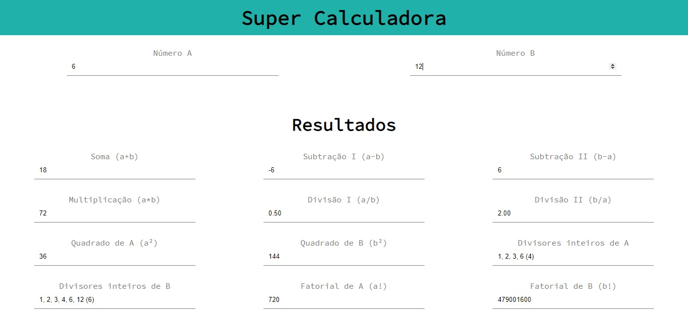

# 🔢 Super Calculator (pt-br)
A simple way of doing some calculations with two numbers.

## 💻 Preview

## 📖 About
An application created with HTML, CSS and JavaScript to exercise:
- Use of HTML elements.
- Use of CSS.
- Use of identifiers in HTML elements.
- Capture reference elements with JavaScript.
- Handling events with JavaScript.
- Implementation of functions with JavaScript.

---
*Developed by Duda Carvalho, September 2020.*
